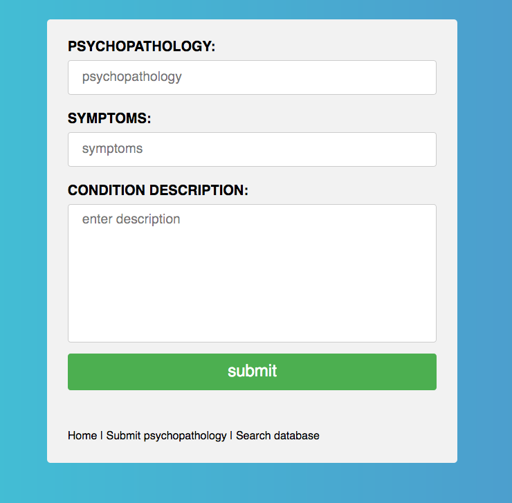

# CUSTOM PSYCHOLOGY DATABASE

A database for mental health students/professionals allowing:
+ Entry of a psychopathology's name, symptoms, and description
+ Search the database of your previous entries and display its description
+ Delete previous psychopathology entries by typing in the name


## Installation
[1] - Download via git:
```bash
git clone git://github.com/lukeguthmann/CustomPsychologyDatabase.git
```


## Usage
1. login to your sql server
2. import file create_database.sql from ```psychology-database/database``` to sql server
3. open database-connection.php from ```psychology-database/database``` to your favourite editor
4. change values inside of ```$db_connection = mysqli_connect('YOURHOST', 'USERNAME', 'PASSWORD', 'DATABASE');```
to your own tokens.
5. open ```index.php``` in your web-browser from ```psychology-database/``` and the server you have the web-app stored


## Program screnshot.



